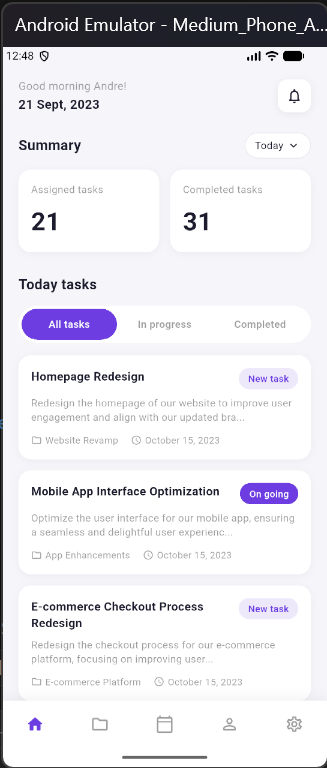
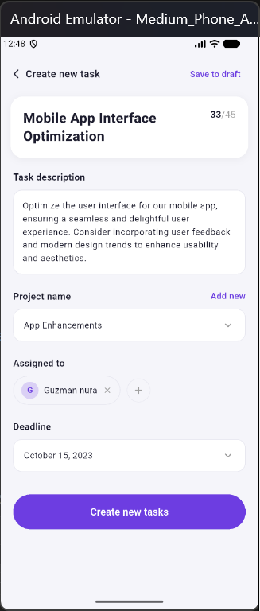

# Flutter Task Management App

A clean and structured task management mobile application built using Flutter for internship assessment.

This project demonstrates:
- UI implementation from Figma design
- Clean architecture and folder structure
- Reusable components
- Basic state management

---

## Features

- View today’s tasks
- Task status indicator (Ongoing / New)

---

##  Project Structure

```
lib/
 ├── main.dart
 ├── core/
 │    └── colors.dart
 ├── models/
 │    └── tasks.dart
 ├── data/
 │    └── sample_task.dart
 ├── screen/
 │    ├── home_screen.dart
 │    └── create_task_screen.dart
 └── widgets/
      └── task_card.dart
```

### Folder Explanation

- **core/** - Constants and theme configuration
- **models/** - Data models (Task)
- **data/** - Static/mock data
- **screen/** - UI screens
- **widgets/** - Reusable components

This structure improves maintainability and scalability.

---

## Reusable Component

### TaskCard

`TaskCard` is a reusable widget that receives a `Task` object and renders the UI dynamically.  
This avoids duplication and keeps the code modular.

---

## State Management

The app currently uses Flutter’s built-in state management:

- StatelessWidget for static UI
- Data passed via constructors
- Easily extendable to Provider or Riverpod

---

## Setup Instructions

1. Clone the repository:
   ```bash
   git clone https://github.com/Sukizanii/flutter-internship-assessment.git
   ```

2. Navigate into project:
   ```bash
   cd flutter-internship-assessment
   ```

3. Install dependencies:
   ```bash
   flutter pub get
   ```

4. Run the app:
   ```bash
   flutter run
   ```

---

## Screenshots


